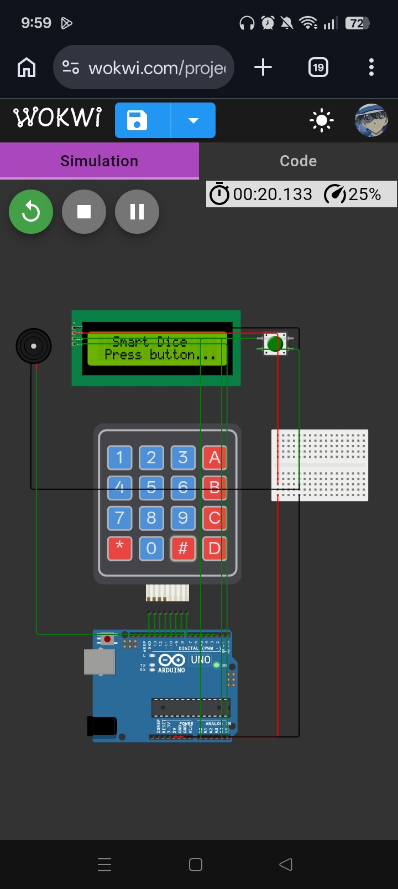

# Dice-Eme

Here's the full wiring list based on the pins used in the sketch (assuming an Arduino Uno/Nano — I2C is on A4/A5 on those boards).

## 1. 4x4 Keypad
| Keypad Pin | Arduino Pin |
|---|---|
| R1 | 4 |
| R2 | 5 |
| R3 | 6 |
| R4 | 7 |
| C1 | 8 |
| C2 | 9 |
| C3 | 10 |
| C4 | 2 |

(No resistors needed — code uses internal `INPUT_PULLUP` on the column pins.)

## 2. 16x2 I2C LCD
| LCD Module Pin | Arduino Pin |
|---|---|
| GND | GND |
| VCC | 5V |
| SDA | A4 |
| SCL | A5 |

## 3. Start Push Button
| Button Leg | Connects To |
|---|---|
| Leg 1 | A0 |
| Leg 2 | GND |

(No resistor needed — internal `INPUT_PULLUP` is used. Button reads LOW when pressed.)

## 4. Buzzer
| Buzzer Pin | Arduino Pin |
|---|---|
| + (signal) | 3 |
| – | GND |

## 5. Reward Motor (via L298N or similar H-bridge driver)
| Driver Pin | Arduino Pin |
|---|---|
| IN1 | 12 |
| IN2 | 13 |
| ENA | 11 (PWM) |
| GND | Arduino GND |

Motor side:
| Driver Pin | Connects To |
|---|---|
| OUT1 | Motor terminal 1 |
| OUT2 | Motor terminal 2 |
| Motor power in (+12V/+9V etc.) | External motor power supply + |
| Driver GND | External supply GND **and** Arduino GND (common ground) |

## Power notes
- Arduino: USB or external 5V/7-9V supply as usual.
- Motor driver: needs its **own** external power source sized for your motor (don't power the motor off the Arduino 5V pin). Just make sure the driver's GND, motor supply GND, and Arduino GND are all tied together (common ground) — otherwise the motor control signals won't work reliably.
- Keypad, LCD, button, and buzzer all run fine off the Arduino's 5V/GND.

Pins **not used** in this build (free for anything else): 0, 1 (Serial — leave alone if you use Serial Monitor), A1, A2, A3.

